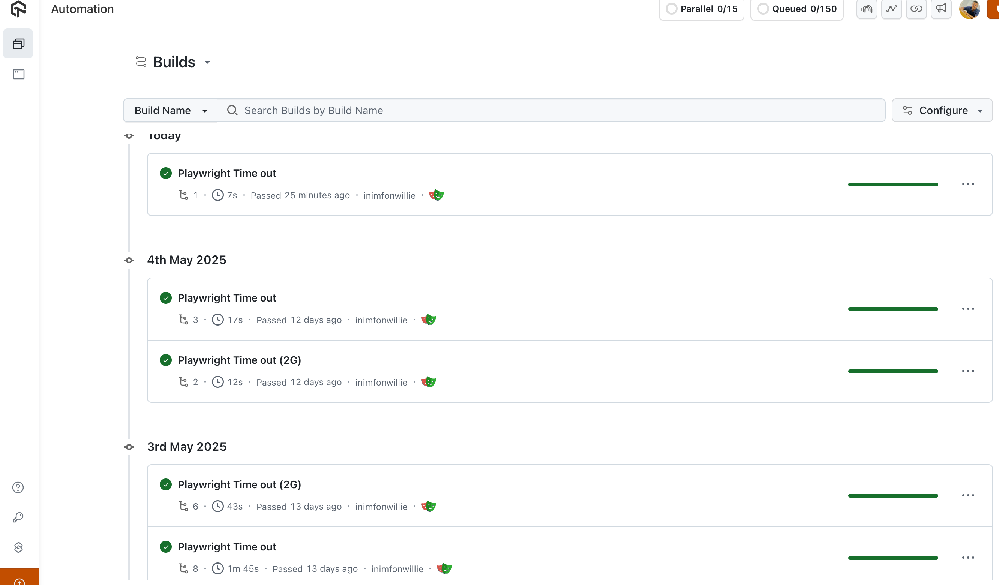

# Playwright Timeout Handling & LambdaTest Integration

This repository demonstrates how to handle timeout errors in Playwright tests, with examples for both local and [LambdaTest Cloud Grid](https://www.lambdatest.com?fp_ref=jaydeep88) execution.

## Table of Contents

- [Prerequisites](#prerequisites)
- [Environment Setup](#environment-setup)
- [Test Scenarios](#test-scenarios)
- [Timeout Handling Examples](#timeout-handling-examples)
  - [Progress Bar Timeout](#1-progress-bar-timeout-progress-barspects)
  - [Dynamic Content Timeout](#2-dynamic-content-timeout-dynamic-contentspects)
  - [Product Image Interaction](#3-product-image-interaction-product-image-interactionspects)
  - [Best Practices](#best-practices-for-timeout-handling)
- [Running Tests Locally](#running-tests-locally)
- [Running Tests on LambdaTest Cloud Grid](#running-tests-on-lambdatest-cloud-grid)
  - [Browser Configuration](#configure-the-project)
  - [Running Specific Browsers](#run-tests-on-specific-browsers)
  - [Running Specific Tests](#run-specific-test-files)
- [Network Throttling](#network-throttling-for-timeout-scenarios)
- [Project Structure](#project-structure)
- [Test Execution on LambdaTest](#test-execution-on-lambdatest)
- [Test Execution on Local Chrome](#test-execution-on-local-chrome)
- [References](#references)

---

## Prerequisites

- **Node.js**: v20.16.0 or higher
- **npm**: v10.8.2 or higher
- **Playwright**: v1.52.0 or higher (tested on 1.52.0)
- **LambdaTest Account**: [Sign up here](https://www.lambdatest.com?fp_ref=jaydeep88) for cloud grid testing

Install dependencies:
```bash
npm install
```

---

## Environment Setup

Create a `.env` file in the root directory with your LambdaTest credentials:

```
LT_USERNAME=your_lambdatest_username
LT_ACCESS_KEY=your_lambdatest_access_key
```

These credentials are required for running tests on LambdaTest.

---

## Test Scenarios

This project includes the following test scenarios:

- **Timeout Handling**:  
  - Verifies that Playwright throws a `TimeoutException` when dynamic content or progress bars take too long to load.
  - Example: Waiting for a progress bar to complete or for dynamic content to appear, and asserting that a timeout error is thrown if it takes too long.

- **Dynamic Content & Image Interactions**:  
  - Interacts with dynamically-loaded images and content, both under normal and throttled network conditions.
  - Example: Hovering over products and verifying that action dialogs appear.

- **Network Throttling**:  
  - Simulates slow network conditions (e.g., 2G) to test timeout scenarios more realistically, especially on LambdaTest.

## Timeout Handling Examples

Each test demonstrates different approaches to handling and managing timeouts:

### 1. Progress Bar Timeout (progress-bar.spec.ts)
```typescript
test('should throw timeout when progress bar is slow', async ({ page }) => {
  
  // Try to wait for completion with a very short timeout
  await expect(async () => {
    await expect(page.locator('.progress-label')).toHaveText('Complete!', { timeout: 1000 });
  }).rejects.toThrow();
});
```
**How it handles the timeout:**
- Sets a short timeout (1s) to simulate a slow operation
- Uses `rejects.toThrow()` to catch and verify the timeout error


### 2. Dynamic Content Timeout (dynamic-content.spec.ts)
```typescript
test('should throw timeout when dynamic content loads too late', async ({ page }) => {
  // Click the button using role selector
  await page.getByRole('button', { name: 'Get Random User' }).click();
  
  // Verify loading state
  const loadingIndicator = page.getByText('Loading...');
  await expect(loadingIndicator).toBeVisible();

  // Assert timeout with specific error message
  await expect(async () => {
    await page.getByRole('img', { name: /random user/i }).waitFor({ timeout: 1000 });
  }).rejects.toThrow('Timeout 1000ms exceeded');
});
```
**How it handles the timeout:**
- Uses role-based selectors for better accessibility
- Verifies loading state before timeout
- Uses `waitFor` with a short timeout to simulate slow content loading
- Catches the specific timeout error message

### 3. Product Image Interaction (product-image-interaction.spec.ts)
```typescript
test('should show product-action dialog on hover in Top Products', async ({ page }) => {
  // Wait for the Top Products heading to be visible
  const topProductsHeading = page.getByRole('heading', { name: 'Top Products' });
  await expect(topProductsHeading).toBeVisible();

  // Find the Top Products section and carousel
  const topProductsSection = topProductsHeading.locator('xpath=ancestor::div[contains(@class,"entry-section")]');
  const swiper = topProductsSection.locator('.mz-tab-listing .swiper-wrapper');
  await expect(swiper).toBeVisible();

  // Hover and verify dialog
  const secondProduct = swiper.locator('.product-thumb.image-top').nth(1);
  await secondProduct.hover();
  const hoverDialog = secondProduct.locator('.product-action');
  await expect(hoverDialog).toBeVisible();
});
```
**How it handles the timeout:**
- Uses role-based selectors for better accessibility
- Implements a robust waiting strategy for dynamic content
- Uses proper element hierarchy for reliable selection
- Demonstrates proper error handling for interactive elements

### Best Practices for Timeout Handling:

1. **Selector Best Practices:**
   - Use role-based selectors (`getByRole`) for better accessibility
   - Use ID selectors for unique elements
   - Use proper element hierarchy for reliable selection
   - Avoid brittle selectors that might change

2. **Timeout Configuration:**
   - Use short timeouts (1s) for testing timeout behavior
   - Use default timeouts (30s) for normal operations
   - Set appropriate timeouts based on the operation type
   - Consider network conditions when setting timeouts

3. **Error Handling:**
   - Use `rejects.toThrow()` for expected timeouts
   - Verify loading states before timeout checks
   - Implement proper error messages
   - Handle both success and failure cases

4. **Test Structure:**
   - Use `test.describe` for grouping related tests
   - Use `test.beforeEach` for common setup
   - Keep tests focused and atomic
   - Use clear, descriptive test names

---

## Handling Timeout Errors in Playwright

Timeouts are a common source of flakiness in end-to-end tests. Playwright provides robust APIs to handle and assert on timeouts:

```typescript
await expect(async () => {
  await expect(page.locator('.progress-label')).toHaveText('Complete!', { timeout: 1000 });
}).rejects.toThrow('Timeout 1000ms exceeded');
```

- Use explicit timeouts in `waitForSelector`, `toHaveText`, etc.
- Use `rejects.toThrow` to assert that a timeout error is thrown when expected.
- For network throttling, set the capability `networkThrottling` in LambdaTest or use Playwright's CDP API locally.

---

## Running Tests Locally

1. **Configure the project**  
   In `playwright.config.ts`, set up the `projects` array for your local browser:

   ```typescript
   {
     name: 'local-chrome',
     use: { ...devices['Desktop Chrome'] },
   }
   ```

2. **Run the tests**  
   ```bash
   npx playwright test --project=local-chrome
   ```

---

## Running Tests on LambdaTest Cloud Grid

1. **Set up your `.env` file** with your LambdaTest credentials.

2. **Configure the project**  
   In `playwright.config.ts`, the projects are configured for LambdaTest:

   ```typescript
   projects: [
     {
       name: "chrome:latest:macOS Sonoma@lambdatest",
     },
     {
       name: "pw-firefox:latest:macOS Sonoma@lambdatest",
     },
     {
       name: "pw-webkit:latest:macOS Sonoma@lambdatest",
     }
   ]
   ```

   Note: For LambdaTest, browser names must be prefixed with `pw-` for Firefox and WebKit.

3. **Run tests on specific browsers**  
   ```bash
   # Run on Chrome
   npx playwright test --project="chrome:latest:macOS Sonoma@lambdatest"

   # Run on Firefox
   npx playwright test --project="pw-firefox:latest:macOS Sonoma@lambdatest"

   # Run on WebKit (Safari)
   npx playwright test --project="pw-webkit:latest:macOS Sonoma@lambdatest"
   ```

4. **Run specific test files**  
   ```bash
   # Run a specific test file on Chrome
   npx playwright test tests/progress-bar.spec.ts --project="chrome:latest:macOS Sonoma@lambdatest"

   # Run all tests matching a pattern on Firefox
   npx playwright test tests/*.spec.ts --project="pw-firefox:latest:macOS Sonoma@lambdatest"
   ```

---

## Network Throttling for Timeout Scenarios

To simulate slow network conditions on LambdaTest, the configuration is set in `lambdatest-setup.ts`:

```typescript
const capabilities = {
  // ...
  "LT:Options": {
    // ...
    networkThrottling: 'Regular 2G',
    // ...
  }
};
```

This simulates a 2G network connection, making timeout scenarios more realistic.

---

## Project Structure

```
.
├── playwright.config.ts    # Playwright configuration
├── lambdatest-setup.ts     # LambdaTest specific setup
├── .env                    # Environment variables
├── package.json
└── tests/
    ├── progress-bar.spec.ts
    ├── dynamic-content.spec.ts
    └── product-image-interaction.spec.ts
```

---

## Test Execution on LambdaTest

The following screenshot shows successful execution of Playwright timeout tests on LambdaTest, including runs with network throttling (2G) and standard conditions. Each build demonstrates that the timeout handling logic works reliably across different network scenarios and browsers.



- All builds passed, confirming robust timeout handling.
- Tests were executed in parallel on Chrome, Firefox, and Safari.
- Network throttling scenarios (2G) were included to simulate real-world slow network conditions.
- Each build is clearly labeled for easy tracking and reporting.

You can view the full project and test code on [GitHub](https://github.com/proGabby/playwright-timeout-handling).

---

## Test Execution on Local Chrome

Below is a screenshot showing the summary of Playwright timeout tests executed locally on Chrome. All tests passed, demonstrating reliable timeout handling and UI interactions in a local environment.


- All test cases passed successfully.
- Tests include dynamic content timeout, product image hover dialog, and progress bar timeout scenarios.
- Confirms that the test suite is robust both locally and on the cloud.

---

## References

- [Playwright Timeout Handling](https://playwright.dev/docs/api/class-locator#locator-wait-for)
- [LambdaTest Playwright Capabilities](https://www.lambdatest.com/support/docs/playwright-automation-capabilities/)
- [LambdaTest Network Throttling](https://www.lambdatest.com/support/docs/network-throttling-in-playwright/)
- [LambdaTest Capabilities Generator](https://www.lambdatest.com/capabilities-generator/)

---

**Happy Testing!**  
For any issues, please open an issue.


