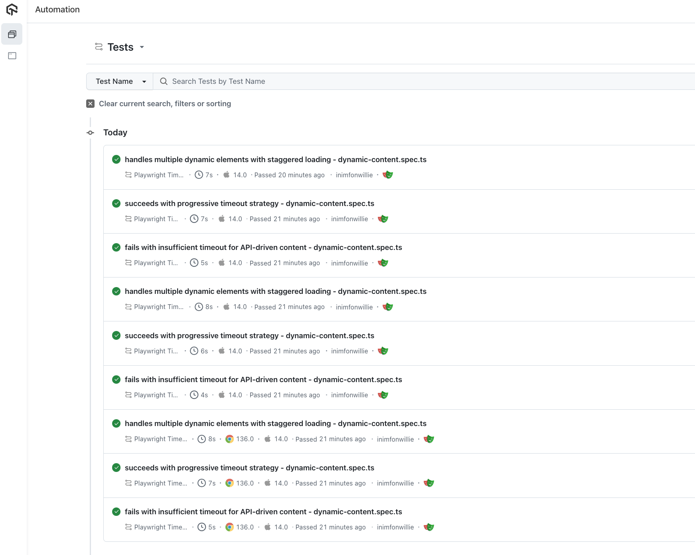
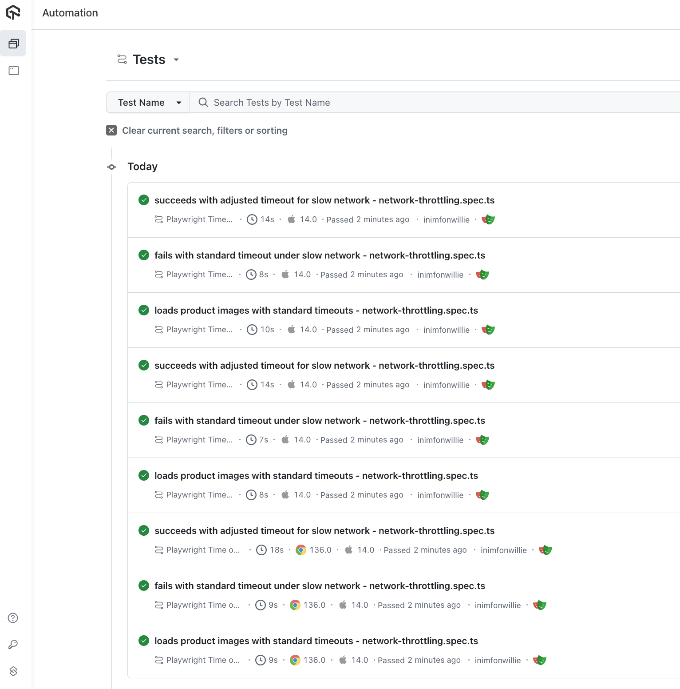
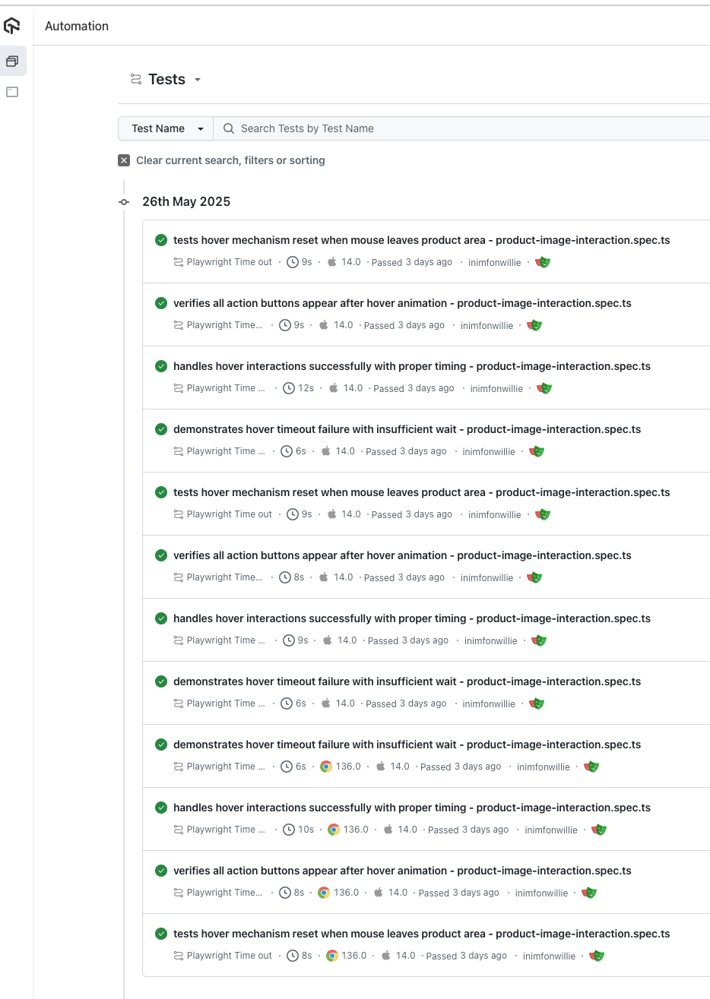
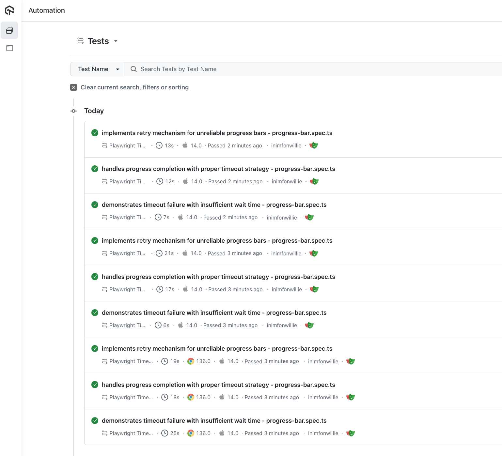
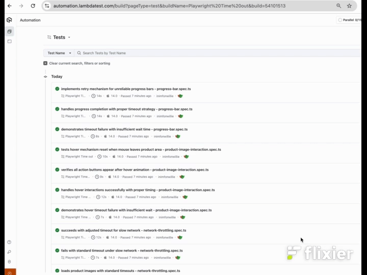

# Playwright Timeout Handling & LambdaTest Integration

This repository demonstrates how to handle timeout errors in Playwright tests, with examples for both local and [LambdaTest Cloud Grid](https://www.lambdatest.com?fp_ref=jaydeep88) execution.

## Table of Contents

- [Quick Start](#-quick-start)
  - [Prerequisites](#prerequisites)
  - [Setup](#setup)
  - [Run Tests](#run-tests)
- [Test Scenarios: Failures vs Fixes](#-test-scenarios-failures-vs-fixes)
  - [Dynamic Content Loading](#1-dynamic-content-loading-dynamic-contentspects)
  - [Network-Dependent Timeouts](#2-network-dependent-timeouts-network-throttlingspects)
  - [CSS Animation Timeouts](#3-css-animation-timeouts-product-image-interactionspects)
  - [Progress Bar Completion](#4-progress-bar-completion-progress-barspects)
- [Network Testing: Standard vs 2G](#-network-testing-standard-vs-2g)
- [Project Structure](#️-project-structure)
- [Browser Configuration](#️-browser-configuration)
- [Test Execution Results](#-test-execution-results)
- [Useful Resources](#-useful-resources)
- [Ready to Master Timeouts?](#-ready-to-master-timeouts)

## 📋 Quick Start

### Prerequisites
- Node.js v20.16.0+
- npm v10.8.2+
- LambdaTest account ([get one free](https://www.lambdatest.com?fp_ref=inimfonwillie))

### Setup
```bash
npm install
```

Create `.env` file:
```
LT_USERNAME=your_lambdatest_username
LT_ACCESS_KEY=your_lambdatest_access_key
NETWORK_TYPE=standard  # or '2g' for slow network testing
```

### Run Tests
```bash
# Test with standard network
npm run test:standard

# Test with 2G network (slow)
npm run test:2g

# Run specific test file
npm run test:standard tests/dynamic-content.spec.ts
```

---

## 🧪 Test Scenarios: Failures vs Fixes

### 1. Dynamic Content Loading (`dynamic-content.spec.ts`)

**The Challenge:** Web apps load user data from APIs. Sometimes it's fast, sometimes it's slow. Your tests need to handle both.

#### ❌ **Failure Scenario: Impatient Timeout**
```typescript
// This WILL fail - only waits 200ms for API response
await expect(async () => {
  await page.locator('#loading img').waitFor({ timeout: 200 });
}).rejects.toThrow(/Timeout 200ms exceeded/);
```
**What happens:** The API call takes longer than 200ms, test fails with timeout error.

#### ✅ **Success Scenario: Progressive Timeout Strategy**
```typescript
// Phase 1: Wait for loading state (3 seconds)
await expect(page.getByText('Loading...')).toBeVisible({ timeout: 3000 });

// Phase 2: Wait for loading to disappear (8 seconds)
await expect(page.getByText('Loading...')).toHaveCount(0, { timeout: 8000 });

// Phase 3: Wait for image to appear in DOM (10 seconds)
await userImage.waitFor({ state: 'attached', timeout: 10000 });

// Phase 4: Verify it's visible (10 seconds)
await expect(userImage).toBeVisible({ timeout: 10000 });
```
**Why it works:** Breaks down the waiting into logical phases, each with appropriate timeouts.

**LambdaTest Execution:**


---

### 2. Network-Dependent Timeouts (`network-throttling.spec.ts`)

**The Challenge:** Your app works fine on fast WiFi, but what about users on slow mobile connections?

#### ❌ **Failure Scenario: Standard Timeout on Slow Network**
```typescript
// This WILL fail on 2G network - timeout too short
await expect(async () => {
  await page.goto(ECOMMERCE_URL, { 
    waitUntil: 'domcontentloaded',
    timeout: 2000  // Only 2 seconds for 2G? No way!
  });
}).rejects.toThrow(/Timeout 2000ms exceeded/);
```
**What happens:** Page takes 10+ seconds to load on 2G, but we only wait 2 seconds.

#### ✅ **Success Scenario: Network-Aware Timeouts**
```typescript
// Standard network: Fast loading (8 seconds max)
await expect(productImages.first()).toBeVisible({ timeout: 8000 });
expect(loadTime).toBeLessThan(10000);

// 2G network: Patient loading (60 seconds max)
await page.goto(ECOMMERCE_URL, {
  waitUntil: 'domcontentloaded',
  timeout: 60000  // Give 2G network time to breathe
});
await expect(productImages.first()).toBeVisible({ timeout: 30000 });
```
**Why it works:** Adjusts timeouts based on expected network conditions.

**LambdaTest Execution:**


---

### 3. CSS Animation Timeouts (`product-image-interaction.spec.ts`)

**The Challenge:** Modern websites use CSS transitions. Hover effects, slide-downs, fade-ins - they all take time.

#### ❌ **Failure Scenario: Ignoring Animation Time**
```typescript
// This WILL fail - CSS transition takes 300ms, we only wait 50ms
await expect(async () => {
  await targetProduct.hover({ timeout: 50 });
  await expect(productAction).toBeVisible({ timeout: 50 });
}).rejects.toThrow(/Timeout.*exceeded/);
```
**What happens:** CSS animation is still running when we check for visibility.

#### ✅ **Success Scenario: Respecting Animation Timing**
```typescript
// Hover and wait for CSS transition to complete
await targetProduct.hover();
console.log('Hover initiated - slide-down animation starting');

// Wait for CSS transition (300ms + buffer)
await expect(productAction).toBeVisible({ timeout: 1000 });

// Verify all action buttons appeared after animation
const expectedButtons = ['Add to Cart', 'Add to Wish List', 'Quick view', 'Compare this Product'];
for (const buttonTitle of expectedButtons) {
  const actionButton = productAction.locator(`button[title="${buttonTitle}"]`);
  await expect(actionButton).toBeVisible({ timeout: 2000 });
}
```
**Why it works:** Accounts for CSS transition time (300ms) plus network latency.

**LambdaTest Execution:**


---

### 4. Progress Bar Completion (`progress-bar.spec.ts`)

**The Challenge:** Progress bars simulate long-running operations. How long should you wait?

#### ❌ **Failure Scenario: Impatient Progress Waiting**
```typescript
// This WILL fail - progress bar takes ~20 seconds, we only wait 1 second
await expect(async () => {
  await expect(page.locator('.progress-label'))
    .toHaveText('Complete!', { timeout: 1000 });
}).rejects.toThrow(/Timed out/);
```
**What happens:** Progress simulation takes much longer than our timeout.

#### ✅ **Success Scenario: Patient Progress Monitoring**
```typescript
// Click to start progress
await page.click('#downloadButton');

// Wait for progress to begin (10 seconds)
await expect(page.locator('#progressbar')).toBeVisible({ timeout: 10000 });

// Wait for completion with generous timeout (30 seconds)
await expect(page.locator('.progress-label'))
  .toHaveText('Complete!', { timeout: 30000 });
```
**Why it works:** Uses realistic timeouts for long-running operations.

**LambdaTest Execution:**


---

## 🌐 Network Testing: Standard vs 2G

### Why Test Both Network Conditions?

**Standard Network:** Tests normal user experience
**2G Network:** Tests worst-case scenarios (rural areas, poor mobile coverage)

### Running Network Tests
```bash
# Test with fast network
npm run test:standard

# Test with slow network (2G simulation)
npm run test:2g

# Compare both networks
npm run test:standard tests/network-throttling.spec.ts
npm run test:2g tests/network-throttling.spec.ts
```

### LambdaTest Network Throttling
The tests automatically configure network throttling on LambdaTest:
- **Standard:** No throttling
- **2G:** `Regular 2G` throttling enabled

---

## 🏗️ Project Structure

```
.
├── tests/
│   ├── dynamic-content.spec.ts        # API loading timeouts
│   ├── network-throttling.spec.ts     # Network-aware timeouts  
│   ├── product-image-interaction.spec.ts # CSS animation timeouts
│   └── progress-bar.spec.ts           # Long operation timeouts
├── lambdatest-setup.ts                # LambdaTest configuration
├── playwright.config.ts               # Playwright settings
├── package.json                       # Scripts and dependencies
└── assets/                            # Execution screenshots
```

---

## 🎛️ Browser Configuration

### Local Testing
```bash
npx playwright test --project=local-chrome
```

### LambdaTest Cloud Testing
```bash
# Chrome on macOS
npm run test:standard -- --project="chrome:latest:macOS Sonoma@lambdatest"

# Firefox on macOS  
npm run test:standard -- --project="pw-firefox:latest:macOS Sonoma@lambdatest"

# Safari on macOS
npm run test:standard -- --project="pw-webkit:latest:macOS Sonoma@lambdatest"
```


## 📊 Test Execution Results

### LambdaTest Cloud Execution
All test scenarios executed successfully across multiple browsers and network conditions:



**Key Results:**
- ✅ All timeout handling scenarios passed
- ✅ Network throttling tests successful
- ✅ Cross-browser compatibility confirmed
- ✅ Both failure and success scenarios validated

### HTML Test Reports
Comprehensive test reports showing detailed execution results:


**Local Test Summary:**
- ✅ Dynamic content timeouts handled correctly
- ✅ Product interaction animations working
- ✅ Progress bar completion successful
- ✅ Network simulation effective

---

## 🔗 Useful Resources

- [Playwright Timeout Documentation](https://playwright.dev/docs/test-timeouts)
- [Playwright Locator Documentation](https://playwright.dev/docs/api/class-locator#locator-wait-for)
- [LambdaTest Playwright Setup](https://www.lambdatest.com/support/docs/playwright-testing/)
- [Capabilities Generator](https://www.lambdatest.com/capabilities-generator/)

---

## 🚀 Ready to Master Timeouts?

1. **Clone this repository**
2. **Set up your LambdaTest credentials**
3. **Run the tests and see failures vs successes**
4. **Apply these patterns to your own tests**

Remember: Good timeout handling isn't just about making tests pass - it's about creating reliable automation that works in the real world, on real networks, with real user conditions.

**Happy Testing!** 🎭


